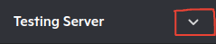
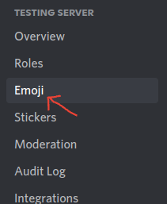
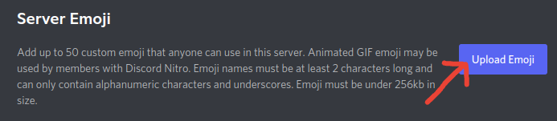
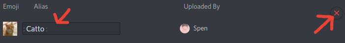

# Custom Emojis 101

### What Are Custom Emojis?

Emojis are a way to express yourself in a more visual format, rather than just plain text. Discord offers a range of default emojis; like 😂. But, you can also make your own ✨ custom emojis ✨ for your server.

#### Emoji Types

There are two emoji types: Static and Animated.

* **Static** means the emoji doesn't move. Static emojis are generally uploaded with `.png` or `.jpg`/`.jpeg` files.
* **Animated** means the emoji does move _\(hints, its animated\)_. Animated emojis are generally uploaded with `.gif` files.

### Limitations

* Emoji names must be at least 2 characters long and can only contain alphanumeric characters and underscores.
* Custom emojis are only usable on the server you've uploaded them to. However, if you have Discord Nitro, you'll be able to use your custom emojis on every server, group, and DM you're in.
* Animated emojis can only be used by Discord Nitro subscribers.
* Emojis must be under 256kb in size.

#### Custom Emoji Slots

By default, every server has 50 static and 50 animated custom emoji slots. However, you can earn more emoji slots by obtaining boost levels.

* Level 0 _\(no level\)_: 50 Static and 50 Animated Emoji Slots
* Level 1: +50 Emoji Slots _\(for a total of 100 emojis per emoji type\)_
* Level 2: +50 Emoji Slots _\(for a total of 150 emojis per emoji type\)_
* Level 3: +100 Emoji Slots _\(for a total of 250 emojis per emoji type\)_

### Creating Custom Emojis

If you have the _manage emojis_ / _administrator_ permission; ****or are the server owner, you can head over to your server and create custom emojis!  Here's how:

**\#1:** Select the dropdown, right next to the Server's Name.

**\#2:** Go to the "Server Settings" 

**\#3:** Click the "Emoji" tab.

**\#4:** Click the "Upload Emoji" button to upload your emoji.

### Editing/Deleting Custom Emojis


This requires the same permissions as creating a emoji. You must have the _manage emojis_ / _administrator_ permission; or be the server owner to modify emojis.


**\#1:** Select the dropdown, right next to the Server's Name.

**\#2:** Go to the "Server Settings" 

**\#3:** Click the "Emoji" tab.

**\#4:** Find the emoji you want to edit/delete, and make your modifications.

* **Deleting**: Click the ❌ button, which is to the right when you hover over the target emoji.
* **Editing**: You can edit a emojis name by hovering over the target emoji, then clicking the text box under the "Alias" section. Once you finish typing the new emoji name, you can save it by clicking the _enter_ key, or clicking elsewhere on your screen.

