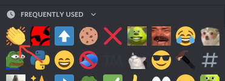

# Using Emojis

So, emojis are cool; right 😅? But, how do I use them? Easy!

**\#1:** Find this little emoji fella, in the right of your message box. Give em a nice click 🖱.

**\#2:** Select the emoji you want to add to your message. Then simply, click that emoji.

Congrats 🎉! You've added a super-duper cool emoji to your message. Now, you can either continue typing your message; or just send it!

