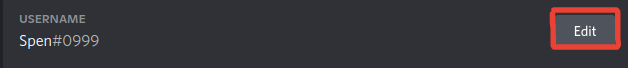
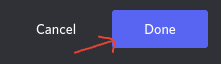

# Discriminators

### What Are Discriminators?

Discriminators are four digit numbers \(between 0001 and 9999\) that start with `#`, they come at the end of a user's username. A username and discriminator put together is called a tag. A user tag looks like this: `User#0000`, "User" being the username and `#0000` being the discriminator. Also note, only your profile shows your tag, generally only your display name \(username/nickname\) is shown when you are chatting in channels.

The purpose of discriminators is to allow multiple users have same username, yet be clearly identifiable. Users can not share the same tag, but users can share 1 of the 2 elements that make up a tag \(username or discriminator\).

Nitro / Nitro Classic users can change their discriminators. However when the subscription ends, the discriminator is changed back to its default randomized state _\(you will no longer have the custom discriminator\)_. In the next section, we will explain how to change your discriminator.

### Changing Your Discriminator 


Remember, inorder to change your discriminator; you must have a Nitro or Nitro Classic subscription!


**\#1:** Click the cog icon, which will open user settings.

**\#2:** Under the "Username" section, click the "Edit" button on the right.

**\#3:** Input your new discriminator in the `#0000` field, and then provide your current password.

**\#4:** Click "Done", this will save the changes you made!

Enjoy your new discriminator :\)

